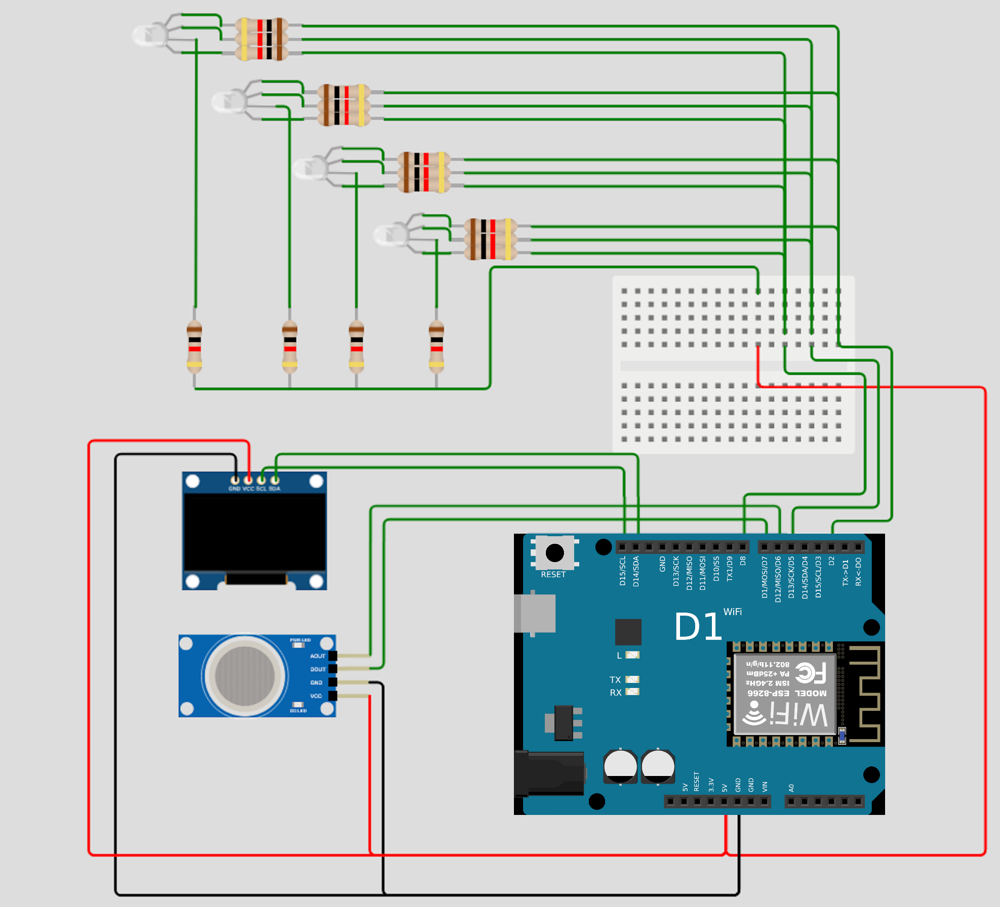
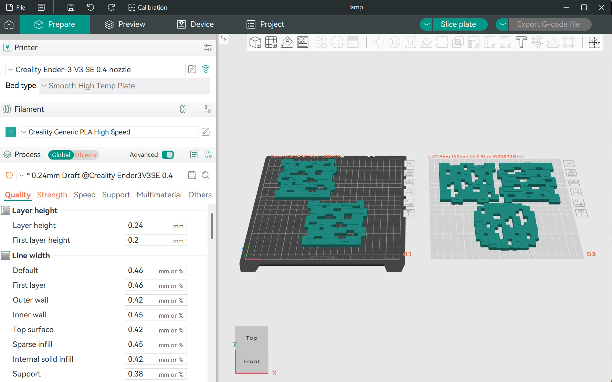
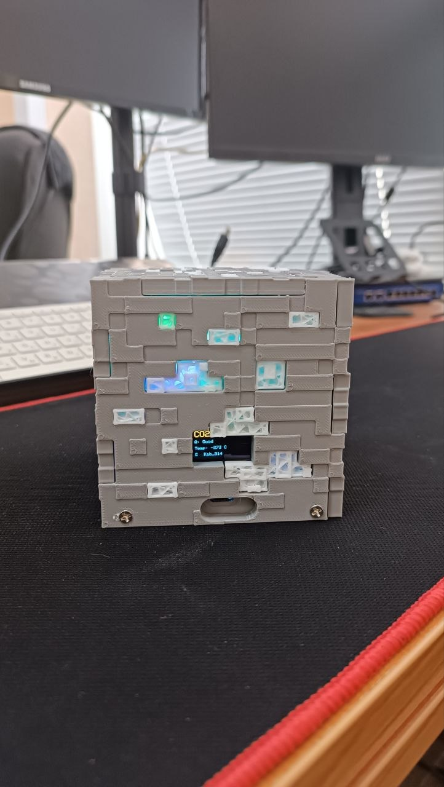
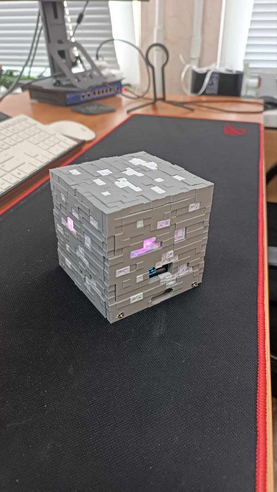

# minecraft CO2 cube lamp

Датчик CO2 (MH-Z19C) на ESP8266




Список компонентов:
- Плата ESP8266 R1
- Датчик CO2 MH-Z19C(B)
- Дисплей OLED 0.96" SS1306
- RGB светодиод с общим катодом
- Резистор (100-220) Ом
- Провода 



Файл модели: 
[Dno_lamp.stl](3d%20printer/Dno_lamp.stl)
[lamp_original.3mf](3d%20printer/lamp_original.3mf)
[windows_minecraft.stl](3d%20printer/windows_minecraft.stl)
[windows_minecraft_grid.3mf](3d%20printer/windows_minecraft_grid.3mf)





Промежуточный сервер для работы telegramm

сервер `murad.serveminecraft.net`

YНастройки nginx:

```
server {
    listen 8443 ssl;
    server_name murad.serveminecraft.net;

    ssl_certificate     /etc/letsencrypt/live/murad.serveminecraft.net/fullchain.pem;
    ssl_certificate_key /etc/letsencrypt/live/murad.serveminecraft.net/privkey.pem;

    location / {
        proxy_pass https://api.telegram.org;

        proxy_ssl_server_name on;
        proxy_set_header Host api.telegram.org;

        proxy_set_header X-Real-IP $remote_addr;
        proxy_set_header X-Forwarded-For $proxy_add_x_forwarded_for;

        proxy_connect_timeout 10s;
        proxy_read_timeout 30s;
    }
}
```
